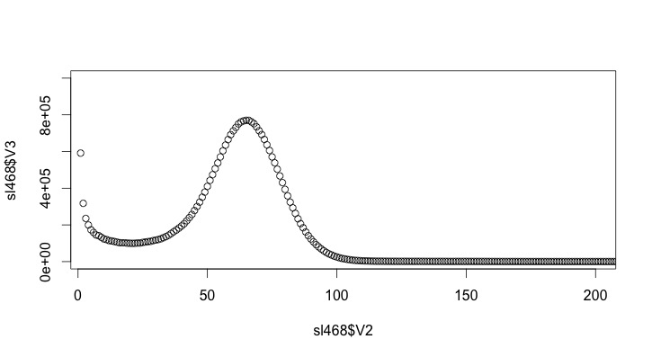

# MSMC_analysis
Scripts to run MSMC on genomes with large numbers of scaffolds using a SLURM cluster

## Input requirements

**Data**

- Read alignment in .bam format, coordinate sorted
- Genome sequence (.fa)

**Software**

- MSMC https://github.com/stschiff/msmc 
- MSMC tools https://github.com/stschiff/msmc-tools
- Samtools (> v1.1) and BCFtools http://www.htslib.org/
- Bedtools https://github.com/arq5x/bedtools2/releases
- SNPable http://lh3lh3.users.sourceforge.net/snpable.shtml

## Data preparation

### Determine coverage distribution of the aligned sample

Make genome index file for Bedtools

`python get_sequence_lengths.py final.assembly.fasta final.assembly.genome`

Get coverage distribution of aligned sample

`bedtools genomecov -ibam alignment_sorted.bam -g final.assembly.genome > <sample_id>.genomecov_summary`

`grep "genome" <sample_id>.genomecov_summary > <sample_id>_genomeonly.genomecov_summary`

Plot coverage distributions in R to determine coverage peak and whether there is any indication of heterozygous regions included in the assembly. 

_Good sample_

One single peak around 65x.

### Prepare MSMC input files

Make mappability mask (according to http://lh3lh3.users.sourceforge.net/snpable.shtml)

`splitfa final.assembly.fasta 100 | split -l 20000000`

Choose a kmer number to reflect the library type you are using for alignment. For paired-ed libraries this is a bit tricky, since this was conceptualised for single end libraries, but since my libraries are narrow 100bp PE libraries, I chose 250 which is on the liberal end.

`bwa index final.assembly.fasta`

`cat xa* > simu_reads.fq`

`bwa aln -R 1000000 -O 3 -E 3 ../Abrun_final.assembly.fasta simu_reads.fq > simu_reads.sai`

`bwa samse -f simu_reads.sam ../Abrun_final.assembly.fasta simu_reads.sai simu_reads.fq`

`gen_raw_mask.pl > rawMask_100.fa`

`gen_mask -l 100 -r 0.5 rawMask_100.fa > mask_100_50.fa`

Change the input and output paths to match the map file just generated in the script "makeMappabilityMask.py" shipped with msmc-tools and run.

`/usit/abel/u1/jacqueh/Software/msmc-tools/makeMappabilityMask.py`

Generate input files from .bam, genome index, mappability info and estimated coverage.

Copy shell script [prepare_MSMC_input.sh](prepare_MSMC_input.sh) and edit file names, coverage info and the locations of the python scripts to reflect your setup and run.

